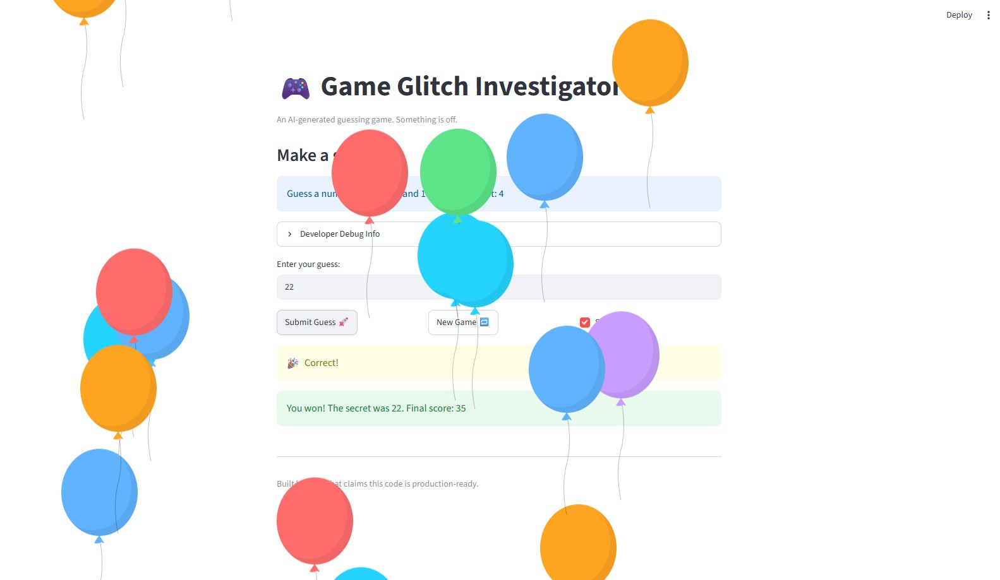

# 🎮 Game Glitch Investigator: The Impossible Guesser

## 🚨 The Situation

You asked an AI to build a simple "Number Guessing Game" using Streamlit.
It wrote the code, ran away, and now the game is unplayable. 

- You can't win.
- The hints lie to you.
- The secret number seems to have commitment issues.

## 🛠️ Setup

1. Install dependencies: `pip install -r requirements.txt`
2. Run the broken app: `python -m streamlit run app.py`

## 🕵️‍♂️ Your Mission

1. **Play the game.** Open the "Developer Debug Info" tab in the app to see the secret number. Try to win.
2. **Find the State Bug.** Why does the secret number change every time you click "Submit"? Ask ChatGPT: *"How do I keep a variable from resetting in Streamlit when I click a button?"*
3. **Fix the Logic.** The hints ("Higher/Lower") are wrong. Fix them.
4. **Refactor & Test.** - Move the logic into `logic_utils.py`.
   - Run `pytest` in your terminal.
   - Keep fixing until all tests pass!

## 📝 Document Your Experience

- [x] Describe the game's purpose.
- [x] Detail which bugs you found.
- [x] Explain what fixes you applied.

## 📸 Demo Walkthrough

Describe your fixed game in numbered steps so a reader can follow along without watching a video:

1. User enters a guess of 50
2. Game returns "Too High"
3. User enters a guess of 75
4. Game returns "Too Low"
5. Score updates correctly after each guess
6. When the user guesses correctly, the game ends and the game congradulates the user.

**Screenshot** 
## 🧪 Test Results

```
# Paste your pytest output here, e.g.:
# pytest tests/
=========================================================== test session starts ===========================================================
platform win32 -- Python 3.13.14, pytest-9.1.1, pluggy-1.6.0
rootdir: C:\Users\yyins\Projects\AI110\ai110-module1show-gameglitchinvestigator-starter
plugins: anyio-4.12.1
collected 6 items                                                                                                                          

tests\test_game_logic.py ......                                                                                                      [100%]

============================================================ 6 passed in 0.07s ============================================================
# ========================= X passed in 0.XXs =========================
```

## 🚀 Stretch Features

- [ ] [If you choose to complete Challenge 4, describe the Enhanced UI changes here — a screenshot is optional]
